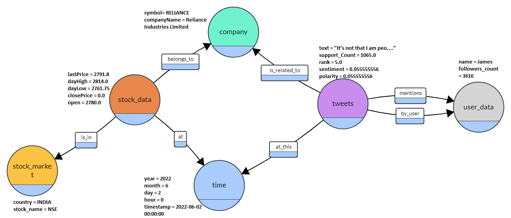

SDM project

# BIG DATA PIPELINE

# Graph Analytics

## Run Instructions - 

1. Edit config file with your username, passward, and created database on Neo4j

2. load data using **PropertyGraph_loading_in_neo4j.ipynb**

3. run analytics using **Graph_Analytics.ipynb**